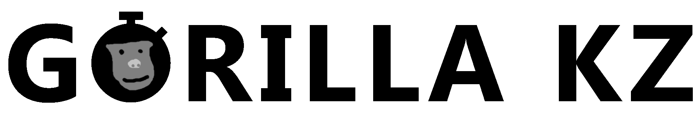

# Gorilla KZ
Full stack time trails mod for Gorilla Tag

## What is this?
Gorilla KZ (GKZ) is a time trials mod for Gorilla Tag that adds a timer and global leaderboards to supported custom maps. Users can compete among each other for the fastest times on the leaderboard. It also supports checkpoints that can be set at any time during the run.

## How do I install it?
1. Follow the [Modding Guide](https://burrito.software/chooseguide/pc-guide) and use Monke Mod Manager to install Monke Map Loader.
2. Download the [latest release](https://github.com/Graicc/GorillaKZ/releases/latest) and follow the guide for manual installation
3. Download compatible maps <!-- DISC-ONLY from <#905197960726450246> --> and place them in `Gorilla Tag\BepInEx\plugins\MonkeMapLoader\CustomMaps`. The Gorilla Tag folder can be found under the Utilities tab in the mod manager.
4. Load a compatible map (by convention prefixed with gkz), ensure that you have a normal (i.e. non modded) gamemode selected, and join the map.
5. Once you have been connected to a room, the timer will turn white and you can begin a run!

## What are the controls for checkpoints?
The primary button on your left controller (e.g. X) sets a checkpoint, the primary button on your right controller (e.g. A) uses a checkpoint, and the secondary button on your left controller (e.g. Y) removes the last checkpoint.

## I made a map, how do I add GKZ support to it?
The build tools to create GKZ compatible maps are not currently publicly available, sorry! Hopefully this will change in the future.